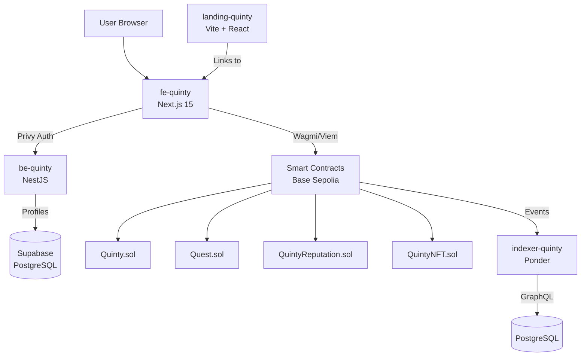
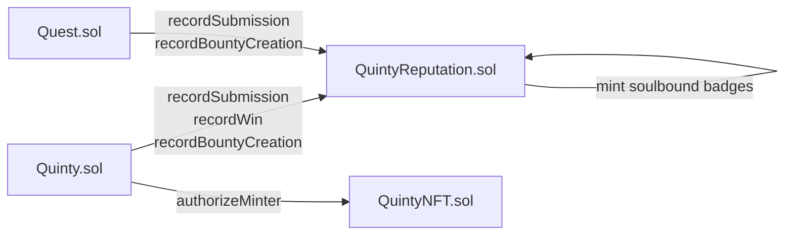
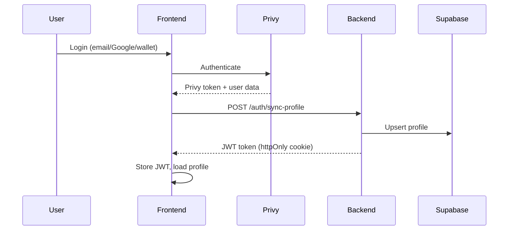

## System Overview

Quinty consists of 6 repositories that work together:

## Component Roles

| Component | Purpose | Stack |
|-----------|---------|-------|
| **fe-quinty** | Web application for users to interact with bounties, quests, and reputation | Next.js 15, React 19, Wagmi, Privy |
| **be-quinty** | Authentication API and user profile management | NestJS, Supabase, JWT |
| **sc-quinty** | Smart contracts that handle all on-chain logic: escrow, judging, reputation | Solidity, Hardhat, OpenZeppelin |
| **indexer-quinty** | Indexes blockchain events into a queryable database | Ponder, PostgreSQL |
| **landing-quinty** | Marketing landing page | Vite, React, GSAP |
| **docs** | This documentation site | Mintlify |

## Contract Interactions

The four contracts interact through authorized caller relationships:

- **Quinty.sol** and **Quest.sol** are authorized callers on QuintyReputation
- When users submit, win, or create bounties/quests, the reputation contract is notified automatically
- QuintyReputation mints soulbound achievement NFTs at milestones (1, 10, 25, 50, 100)

## Authentication Flow

Users authenticate through Privy and the backend issues a JWT for API calls:

## Data Flow

**Creating a bounty:**
1. User fills form in frontend
2. Frontend calls `Quinty.sol.createBounty()` via Wagmi
3. Transaction confirmed on Base Sepolia
4. Indexer picks up `BountyCreated` event
5. Bounty appears in GraphQL queries and frontend lists

**Submitting work:**
1. User uploads proof to IPFS via Pinata
2. Frontend calls `Quinty.sol.submitToBounty()` with IPFS CID and deposit
3. QuintyReputation records the submission
4. Indexer picks up `SubmissionCreated` event
