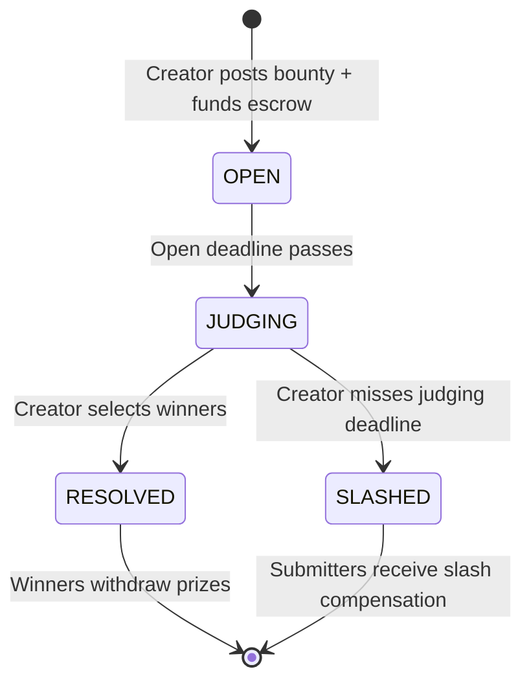
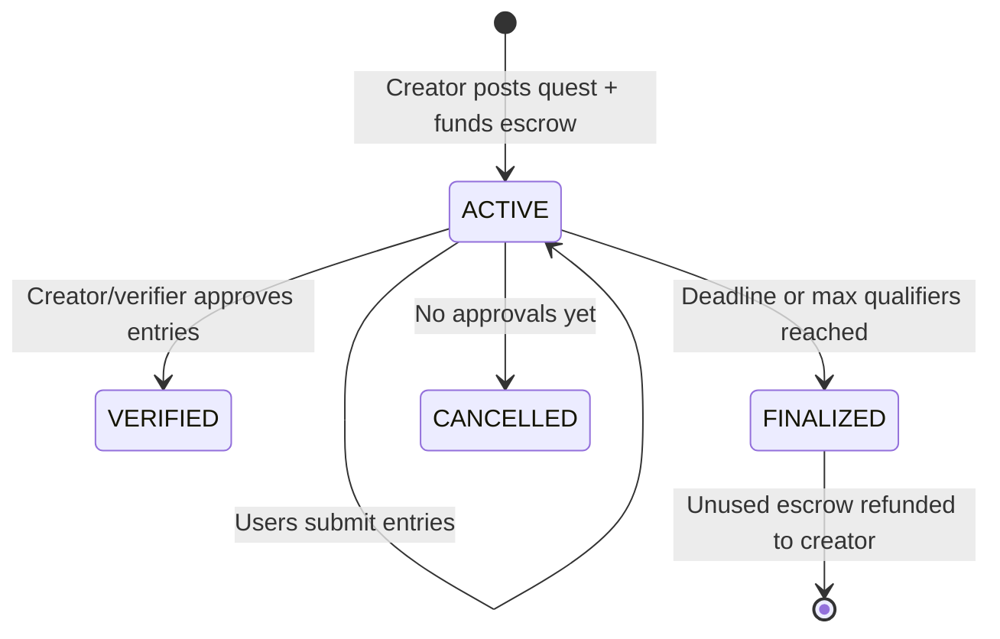

## Bounty Flow

A bounty goes through four phases: Open, Judging, and then either Resolved or Slashed.

### Step by Step

1. **Creator posts a bounty** with a title, description, prize tiers (up to 10 winners), open deadline, and judging deadline. The total prize amount is locked in escrow immediately.

2. **Solvers submit work** during the open phase. Each submission requires a 1% deposit of the total bounty amount, which is refunded regardless of outcome.

3. **Open deadline passes** and the bounty moves to judging. No more submissions are accepted.

4. **Creator selects winners** by ranking submissions. Winners receive their prize tier plus their deposit back. Non-winners get their deposits refunded. All payments are credited to a pull balance.

5. **If the creator doesn't judge by the deadline**, anyone can trigger a slash. The slash percentage (25-50%) is distributed equally among all submitters, and the remainder returns to the creator.

6. **Winners withdraw** their earnings by calling the withdraw function.

## Quest Flow

Quests are simpler: a fixed reward is paid to each qualifier up to a maximum count.

### Step by Step

1. **Creator posts a quest** with requirements, a reward per qualifier, and a max qualifier count. Escrow = reward x max qualifiers.

2. **Users submit entries** with IPFS proof. No deposit is required for quests.

3. **Creator or delegated verifiers review entries.** Approved entries are immediately credited with the fixed reward. A verifier cannot approve their own entry.

4. **Quest auto-finalizes** when max qualifiers is reached, or anyone can finalize after the deadline.

5. **Unused escrow** (if fewer qualifiers than max) is refunded to the creator.

6. **Qualifiers withdraw** their rewards via the pull-based withdrawal system.
