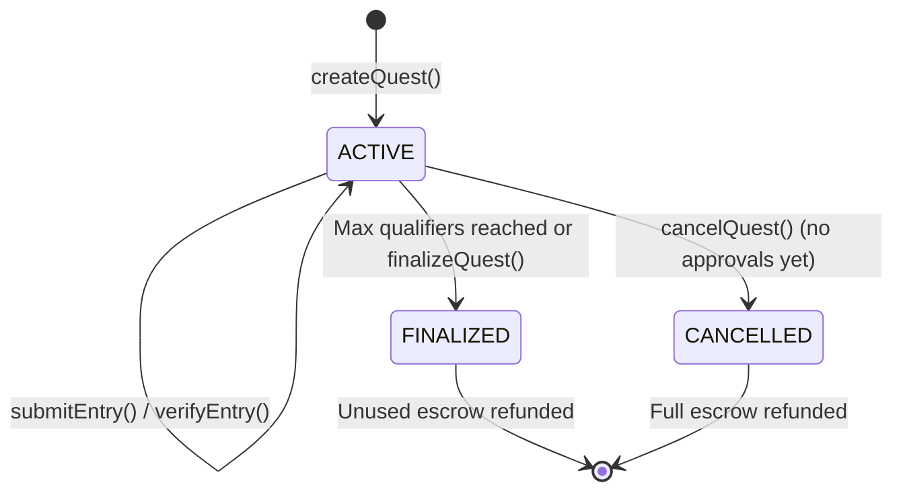

## Quest Lifecycle

Quests follow a simpler flow than bounties. There is no deposit requirement and rewards are paid per qualifier.



## Key Concepts

**Fixed reward per qualifier.** Unlike bounties with ranked prizes, every approved quest entry receives the same amount. The escrow is `perQualifier * maxQualifiers`.

**Delegated verifiers.** The quest creator can add other addresses as verifiers who can approve or reject entries. A verifier cannot approve their own entry.

**Auto-finalization.** When the number of approved entries reaches `maxQualifiers`, the quest automatically finalizes. No further entries are accepted.

**Cancellation.** The creator can cancel a quest and get a full refund, but only if no entries have been approved yet. Cancellation works even when the contract is paused (refund safety).

## Key Functions

### Creating

```solidity
function createQuest(
    string title,
    string description,
    uint256 perQualifier,      // Reward per approved entry
    uint256 maxQualifiers,     // Maximum approved entries
    uint256 deadline,          // Unix timestamp
    string requirements,       // What submitters need to do
    address token              // address(0) for ETH, or whitelisted ERC-20
) external payable             // msg.value = perQualifier * maxQualifiers (ETH)
```

### Submitting

```solidity
function submitEntry(
    uint256 questId,
    string ipfsCid             // IPFS proof of completion
) external                     // No deposit required
```

### Verifying

```solidity
function verifyEntry(
    uint256 questId,
    uint256 entryId,
    uint8 status,              // 1 = Approved, 2 = Rejected
    string feedback
) external                     // Creator or delegated verifier

function verifyMultipleEntries(
    uint256 questId,
    uint256[] entryIds,
    uint8[] statuses,
    string[] feedbacks
) external                     // Batch verify (max 50)
```

### Managing Verifiers

```solidity
function addVerifier(uint256 questId, address verifier) external    // Creator only
function removeVerifier(uint256 questId, address verifier) external // Creator only
```

### Finalizing

```solidity
function finalizeQuest(uint256 questId) external  // Creator, owner, or anyone after deadline
function cancelQuest(uint256 questId) external     // Creator only, no approvals yet
```

### Withdrawals

```solidity
function withdrawETH() external
function withdrawToken(address tokenAddr) external
```

## View Functions

| Function | Returns |
|----------|---------|
| `getQuest(id)` | All quest data |
| `getEntry(questId, entryId)` | Single entry |
| `getEntryCount(questId)` | Number of entries |
| `getUserSubmission(questId, addr)` | User's entry data |
| `getQuestStats(questId)` | Pending, approved, rejected counts and remaining slots |
| `pendingBalance(token, user)` | Withdrawable balance |
| `questVerifiers(questId, addr)` | Whether address is a verifier |
