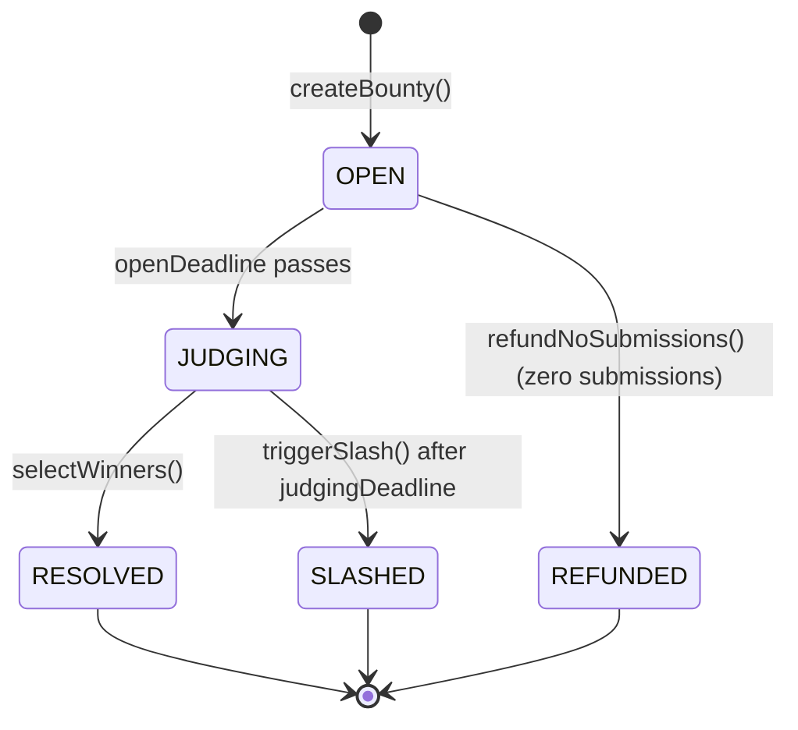

## Bounty Lifecycle

Every bounty goes through a series of phases controlled by deadlines:



| Status | Value | Description |
|--------|-------|-------------|
| OPEN | 0 | Accepting submissions |
| JUDGING | 1 | Open deadline passed, creator must select winners |
| RESOLVED | 2 | Winners selected, funds distributed |
| SLASHED | 3 | Creator missed judging deadline, submitters compensated |

## Prize Tiers

Bounties support 1 to 10 winners with ranked prize tiers. The `prizes[]` array defines how much each rank receives.

Example: A bounty with 3 winners might have `prizes = [500, 300, 200]` (total = 1000). The creator funds 1000 into escrow. First place gets 500, second gets 300, third gets 200.

If the creator selects fewer winners than prize slots, unused prizes are refunded to the creator.

## Submission Deposit

Every submitter pays a **1% deposit** of the total bounty amount. This deposit is:

- **Refunded** to all submitters (winners and non-winners) when the bounty resolves
- **Refunded** as part of slash compensation if the creator is slashed

The deposit prevents spam submissions and gives submitters skin in the game.

## Slash Mechanism

If the creator fails to select winners before the judging deadline, anyone can call `triggerSlash()`:

- **Slash percentage** is set by the creator at bounty creation (25-50%, in basis points)
- `slashAmount = totalAmount * slashPercent / 10000`
- Each submitter receives `slashAmount / submitterCount` plus their deposit
- The creator receives `totalAmount - slashAmount`

This incentivizes creators to judge on time.

## Key Functions

### Creating

```solidity
function createBounty(
    string title,
    string description,
    uint256 openDeadline,      // Unix timestamp
    uint256 judgingDeadline,    // Unix timestamp (must be after openDeadline)
    uint256 slashPercent,      // 2500-5000 (25-50%)
    uint256[] prizes,          // Ranked prize amounts
    address token              // address(0) for ETH, or whitelisted ERC-20
) external payable
```

### Submitting

```solidity
function submitToBounty(
    uint256 bountyId,
    string ipfsCid            // IPFS content identifier for the submission
) external payable            // msg.value = 1% deposit (for ETH bounties)
```

### Judging

```solidity
function selectWinners(
    uint256 bountyId,
    uint256[] submissionIds    // Ordered by rank (first = 1st place)
) external                    // Only bounty creator
```

### Slashing

```solidity
function triggerSlash(
    uint256 bountyId
) external                    // Anyone, after judgingDeadline
```

### Withdrawals

```solidity
function withdrawETH() external
function withdrawToken(address tokenAddr) external
```

## View Functions

| Function | Returns |
|----------|---------|
| `getBounty(id)` | All bounty data including token, prizes, status |
| `getSubmission(bountyId, subId)` | Single submission |
| `getAllSubmissions(bountyId)` | All submissions for a bounty |
| `getRequiredDeposit(bountyId)` | 1% of total bounty amount |
| `getCurrentPhase(bountyId)` | Current phase string |
| `pendingBalance(token, user)` | User's withdrawable balance |
| `hasUserSubmitted(bountyId, addr)` | Whether user already submitted |
